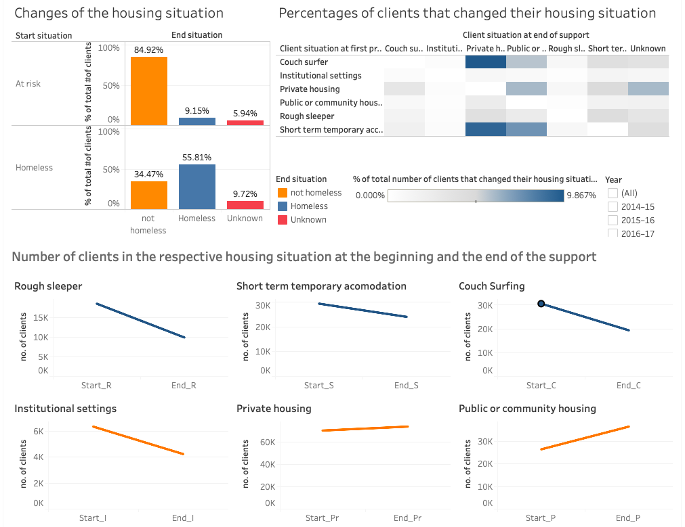
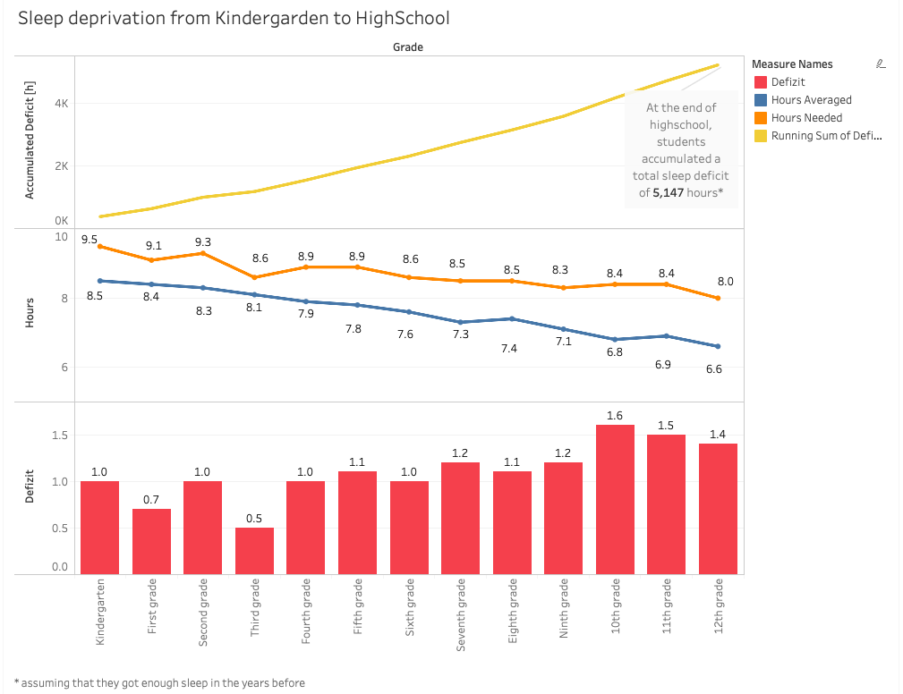

##### [Back](index#projects)
## Makeover Mondays
I got introduced to [Makeover Monday](https://www.makeovermonday.co.uk) in my Data Viz class at UC Berkeley. Under the hashtag #makeovermonday, people from all over the world redesign one particular visualization every week. This visualization is picked by [Eva Murray and Andy Kriebel](https://www.makeovermonday.co.uk/about-us/), two data viz gurus, who have the intention to create a learning experience, better visualizations and an exchange about best practices.

I participated for the first time in week 8 of this year and really enjoyed being part of the Makeover Monday community and working on a specific dataset along professionals and data viz beginners like me.  
My goal is to participate in more #makeovermondays to improve my design and tableau skills.

#### Week 8: Housing outcomes for clients of Australian Specialist Homelessness Services

Data Set and picked Visualization can be found on [data.world](https://data.world/makeovermonday/2020w8){:target="_blank"}

[My redesign](https://public.tableau.com/profile/henny7470#!/vizhome/MoM_w8_HomelessnessAustralia/Dashboard1){:target="_blank"}:

Data Source: [AIHW Specialist homelessness services annual report 2017–18](https://www.aihw.gov.au/reports/homelessness-services/specialist-homelessness-services-2017-18/data){:target="_blank"}

#### Week 9: Costing Kids Sleep

Data Set and picked Visualization can be found on [data.world](https://data.world/makeovermonday/2020w9){:target="_blank"}

[My redesign](https://public.tableau.com/profile/henny7470#!/vizhome/MoM_w9_SleepData/Dashboard2){:target="_blank"}:

Data Source: [Costing Kids Sleep](https://savvysleeper.org/costing-kids-sleep/){:target="_blank"}
