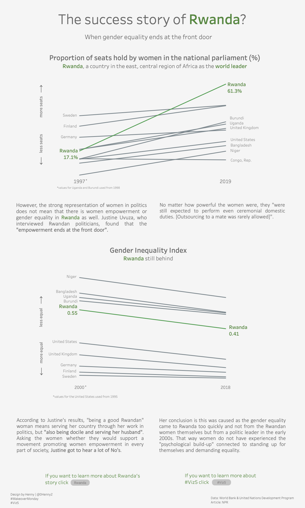
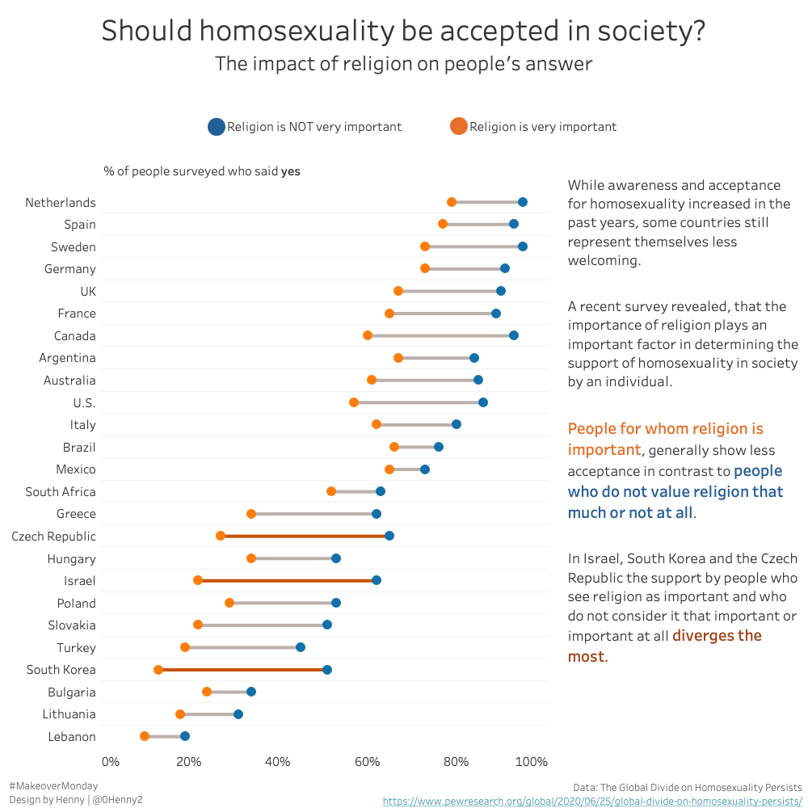
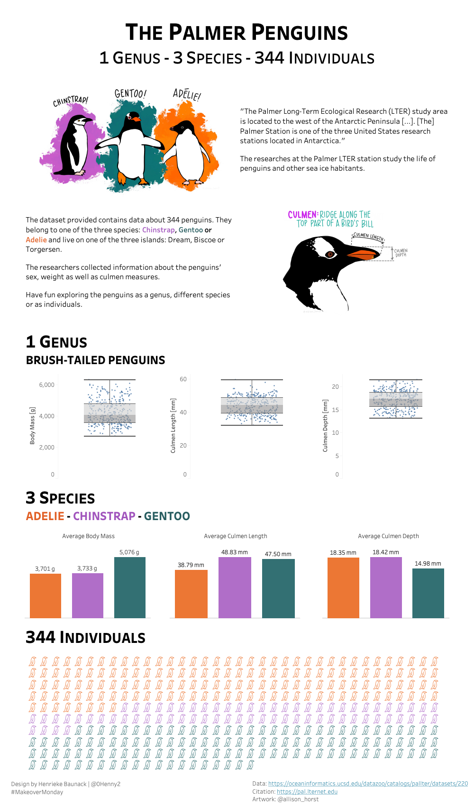
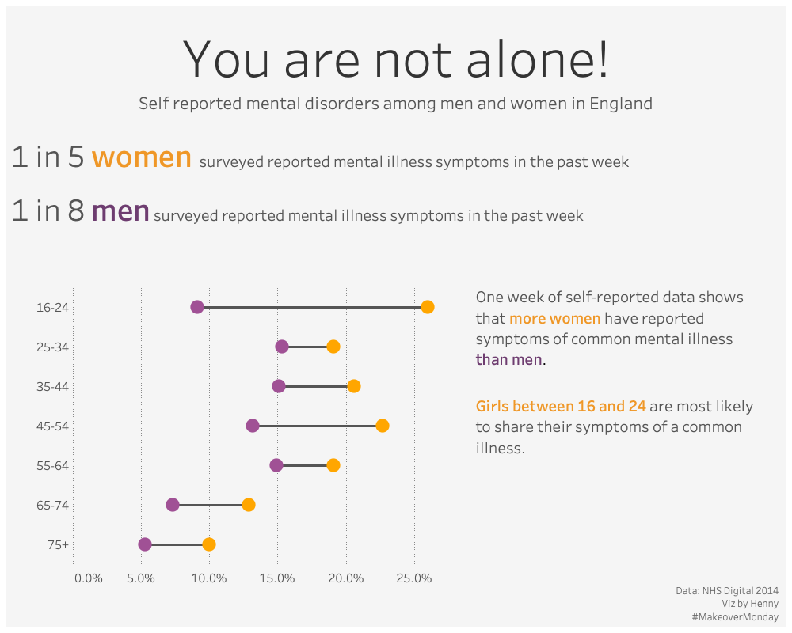
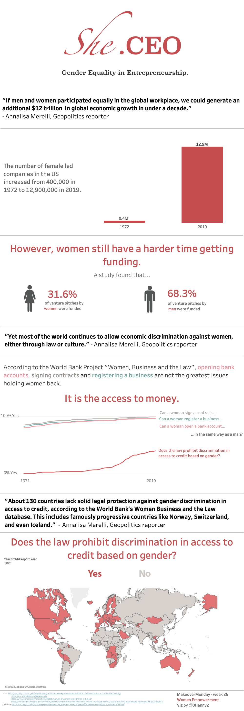
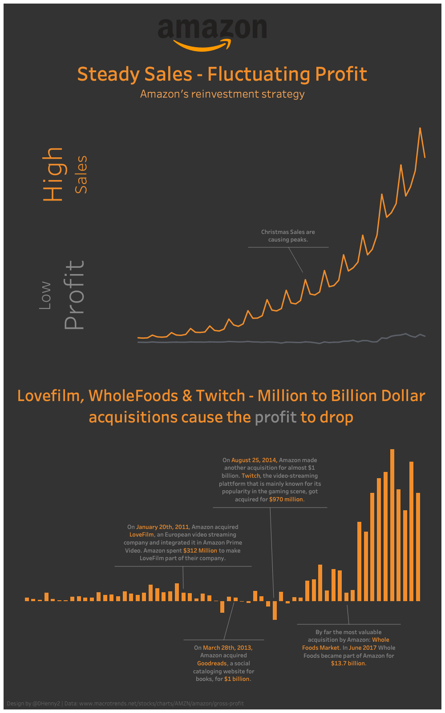

##### [Back](index#projects)
## Makeover Mondays
I got introduced to [Makeover Monday](https://www.makeovermonday.co.uk) in my Data Viz class at UC Berkeley. Under the hashtag #makeovermonday, people from all over the world redesign one particular visualization every week. This visualization is picked by [Eva Murray and Andy Kriebel](https://www.makeovermonday.co.uk/about-us/), two data viz gurus, who have the intention to create a learning experience, better visualizations and an exchange about best practices.

I participated for the first time in week 8 of this year and really enjoyed being part of the Makeover Monday community and working on a specific dataset along professionals and data viz beginners like me.  
My goal is to participate in more #makeovermondays to improve my design and tableau skills.

 

### Week 30: Women in Power, [#Viz5](https://www.makeovermonday.co.uk/viz5/)

Data Set and picked Visualization can be found on [data.world](https://data.world/makeovermonday/2020w30){:target="_blank"}

[My redesign](https://public.tableau.com/profile/henny7470#!/vizhome/MoM_w30_FemalesInPolitics/FinalDashboard){:target="_blank"}:

Data Source: [World Bank](http://api.worldbank.org/v2/en/indicator/SG.GEN.PARL.ZS?downloadformat=excel){:target="_blank"}

 

### Week 29: Should Homosexuality be accepted in society?

Data Set and picked Visualization can be found on [data.world](https://data.world/makeovermonday/2020w29-the-global-divide-on-homosexuality-persists){:target="_blank"}

[My redesign](https://public.tableau.com/profile/henny7470#!/vizhome/MoM_w29_AcceptanceHomosexuality/finalDashboard2){:target="_blank"}:

Data Source: [Pew Research](https://www.pewresearch.org/global/2020/06/25/global-divide-on-homosexuality-persists/){:target="_blank"}

 

### Week 28: Flipper and Bill Length for Adelie, Chinstrap and Gentoo Penguins at Palmer Station Antarctica LTER

Data Set and picked Visualization can be found on [data.world](https://data.world/makeovermonday/2020w28){:target="_blank"}

[My redesign](https://public.tableau.com/profile/henny7470#!/vizhome/MoM_w28_PalmerPenguins/FinalDashboard){:target="_blank"}:

Data Source: [Structural size measurements and isotopic signatures](https://oceaninformatics.ucsd.edu/datazoo/catalogs/pallter/datasets/220){:target="_blank"}

 

### Week 27: Comparing common mental disorder by sex

Data Set and picked Visualization can be found on [data.world](https://data.world/makeovermonday/2020w27-comparing-common-mental-disorder-by-sex){:target="_blank"}

[My redesign](https://public.tableau.com/profile/henny7470#!/vizhome/MoM_w27_MentalHealthUK/FINAL_V2_light){:target="_blank"}:

Data Source: [NHS Digital](https://digital.nhs.uk/data-and-information/publications/statistical/adult-psychiatric-morbidity-survey/adult-psychiatric-morbidity-survey-survey-of-mental-health-and-wellbeing-england-2014){:target="_blank"}

 

### Week 26: Economic Empowerment, [#Viz5](https://www.makeovermonday.co.uk/viz5/)

Data Set and picked Visualization can be found on [data.world](https://data.world/makeovermonday/2020w26/){:target="_blank"}

[My redesign](https://public.tableau.com/profile/henny7470#!/vizhome/MoM_w26_WomenInBusiness_V2/Dashboard1){:target="_blank"}:

Data Source: [World Bank](https://wbl.worldbank.org/en/wbl-data){:target="_blank"}

 

### Week 25: Amazon’s tiny profits, explained

Data Set and picked Visualization can be found on [data.world](https://data.world/makeovermonday/2020w25-amazons-tiny-profits-explained){:target="_blank"}

[My redesign](https://public.tableau.com/profile/henny7470#!/vizhome/MoM_w25_AmazonProfit/FinalDashboard?publish=yes){:target="_blank"}:

Data Source: [macrotrends.net](https://www.macrotrends.net/stocks/charts/AMZN/amazon/gross-profit){:target="_blank"}

 

### Week 24: High School Sports in the US

Data Set and picked Visualization can be found on [data.world](https://data.world/makeovermonday/2020w24){:target="_blank"}

[My redesign](https://public.tableau.com/profile/henny7470#!/vizhome/MoM_w24_HighSchoolSports/FinalDashboard){:target="_blank"}:

Data Source: [NFHS Participation rates](https://members.nfhs.org/participation_statistics){:target="_blank"}

 

### Week 23: Animal-free products consumption in Great Britain

Data Set and picked Visualization can be found on [data.world](https://data.world/makeovermonday/2020w23-animal-free-products-consumption-in-great-britain){:target="_blank"}

[My redesign](https://public.tableau.com/profile/henny7470#!/vizhome/MoM_w23_MeatSubstitutes/finalDashboard){:target="_blank"}:

Data Source: [Statista](https://www.statista.com/statistics/1065843/animal-free-products-consumption-frequency-in-great-britain-by-eating-habits/){:target="_blank"}

 

### Week 22: Safe Houses: Places of Sanctuary for Girls and Women At Risk of FGM, [#Viz5](https://www.makeovermonday.co.uk/viz5/)

Data Set and picked Visualization can be found on [data.world](https://data.world/makeovermonday/2020w22/){:target="_blank"}

[My redesign](https://public.tableau.com/profile/henny7470#!/vizhome/MoM_w22_FGM/Dashboard1?publish=yes){:target="_blank"}:

Data Source: [Hope for Girls and Women Tanzania](https://hopeforgirlsandwomen.com/safe-houses/){:target="_blank"}

 

### Week 21: Visualising 40 Years of Music Industry Sales

Data Set and picked Visualization can be found on [data.world](https://data.world/makeovermonday/2020w21-visualizing-40-years-of-music-industry-sales){:target="_blank"}

[My redesign](https://public.tableau.com/profile/henny7470#!/vizhome/MoM_w21_MusicSales/SecondDesign?publish=yes){:target="_blank"}:

Data Source: [RIAA](https://www.riaa.com/u-s-sales-database/){:target="_blank"}

 

### Week 9: Costing Kids Sleep

Data Set and picked Visualization can be found on [data.world](https://data.world/makeovermonday/2020w9){:target="_blank"}

[My redesign](https://public.tableau.com/profile/henny7470#!/vizhome/MoM_w9_SleepData/Dashboard2){:target="_blank"}:

Data Source: [Costing Kids Sleep](https://savvysleeper.org/costing-kids-sleep/){:target="_blank"}

 

### Week 8: Housing outcomes for clients of Australian Specialist Homelessness Services

Data Set and picked Visualization can be found on [data.world](https://data.world/makeovermonday/2020w8){:target="_blank"}

[My redesign](https://public.tableau.com/profile/henny7470#!/vizhome/MoM_w8_HomelessnessAustralia/Dashboard1){:target="_blank"}:

Data Source: [AIHW Specialist homelessness services annual report 2017–18](https://www.aihw.gov.au/reports/homelessness-services/specialist-homelessness-services-2017-18/data){:target="_blank"}

