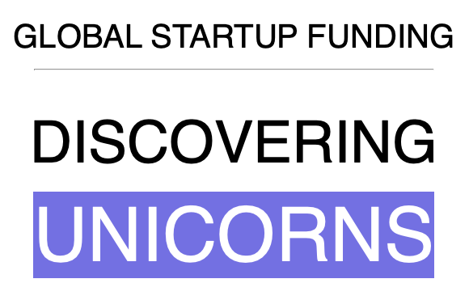

##### [Back](index)
# Data visualization - Global Startup Funding

For the final project in my Data Viz class, my team partner and I worked with a datset about startup investments. To narrow down our scope we decided to focus on unicorn startups (i.e. startups with an evaluation above 1 Billion Dollar) and enable the user of our website to explore the investment trends. 

The [website](https://henny2.github.io/StartUpFunding/) is sill work in progress but please check it out and send feedback or ideas.

