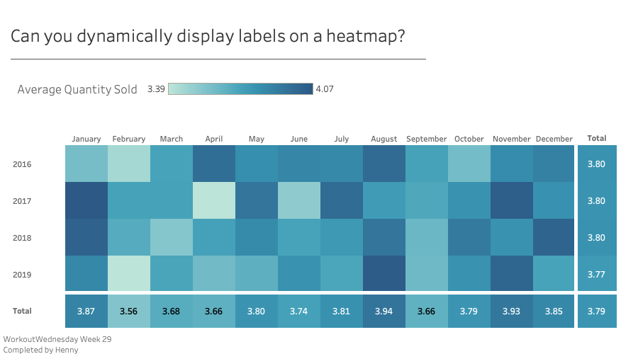
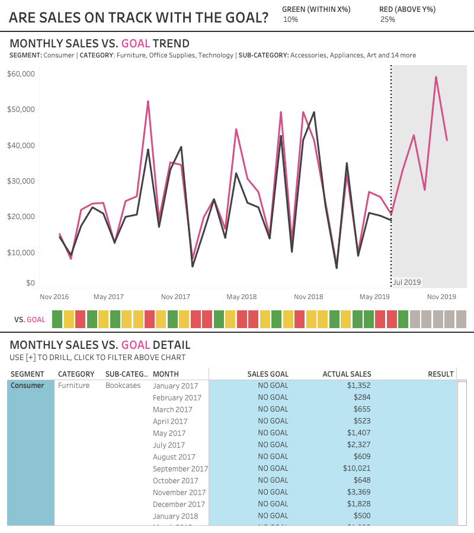

##### [Back](index#projects)
## Workout Wednesday
Through the amazing dataviz community on Twitter I just recently got introduced to [Workout Wednesday](http://www.workout-wednesday.com). In case you don’t know me, I never skip a (CrossFit) workout, thus I was curious to participate in Workout Wednesday as well. 

Workout Wednesday is a weekly Tableau challenge where you have to recreate a dashboard that fits certain requirements. I already learned so many new Tableau hacks taking part in the first two weeks that I committed to continue. Take a look at the recreated dashboards below.

 

### 2020 Week 29: Can you dynamically display label on a heatmap?

Challenge description and dashboard that was meant to be recreated can be found [here](http://www.workout-wednesday.com/2020w29/).

[My recreation](https://public.tableau.com/profile/henny7470#!/vizhome/WOW_w29_Dynamically-display-heat-map-labels/Canyoudynamicallydisplaylabelsonaheatmap){:target="_blank"}:

#### Things I learned:
- use of complex set actions
- use of sets and calculated field to create individual labels
- displaying totals and color them in a heat map
- dynamically displaying labels

 

### 2020 Week 28: Are Sales on Track with Goal?

Challenge description and dashboard that was meant to be recreated can be found [here](http://www.workout-wednesday.com/2020w28/).

[My recreation](https://public.tableau.com/profile/henny7470#!/vizhome/WOW_w28_Are-sales-on-track-with-the-goal/ARESALESONTRACKWITHTHEGOAL){:target="_blank"}:

#### Things I learned:
- use custom of number format
- use of reference bands
